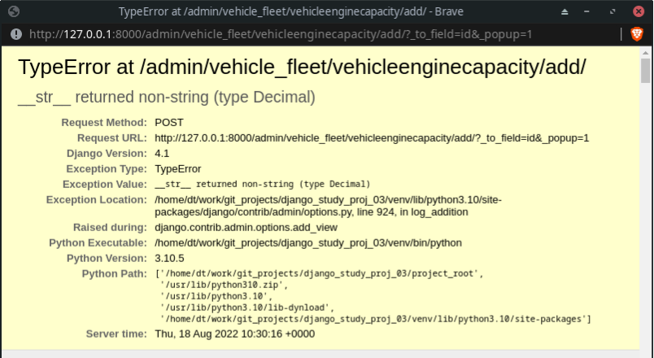

# Ход работы

Проект "Автопарк"

<h2>Первичные настройки</h2>

Создать приложение `vehicle_fleet`

Зарегистрировать приложение ([commit](https://github.com/DanilTsygolnik/django_study_proj_03/commit/bdbd71d4f8edaff1b9ea9e11e53839c2e3113055)).

<h2>Этап 1</h2>

#### Задача

Создать основную модель Vehicle (автомобиль) с несколькими полями на усмотрение (например, стоимость, год выпуска, пробег, и т. д.). Марку/бренд с техническими характеристиками пока не добавлять - это будет отдельная модель.

Зарегистрировать модель в админке, добавить 3-5 объектов в базу.

#### Ход работы

Создать модель Vehicle ([commit](https://github.com/DanilTsygolnik/django_study_proj_03/commit/023664c8a9e7cef50a662368ef357a637e280f44)).

Создать миграции для модели ([commit](https://github.com/DanilTsygolnik/django_study_proj_03/commit/86ea9811b90348078362afaf95b830f71a9a5c68)).

Зарегистрировать модель `Vehicle` в админке ([commit](https://github.com/DanilTsygolnik/django_study_proj_03/commit/0416ea85f61c2b68c5ece94c525edf57eb0ff9d6)).

Result
 
Вид админки до и после

<h2>Этап 2</h2>

#### Задача

Добавить отдельную модель брендов и привязать её к модели Vehicle, чтобы в админке, когда создаётся или редактируется новый автомобиль, поле бренда показывалось как выпадающий список. 

Добавить в модель Vehicle несколько других характеристик (например, тип авто, кол-во мест, цвет).

Выводить данные автомобиля в админке в более наглядном виде: id + бренд + пробег или цена например.

<h4>Описание полей</h4>

VehicleBrand (марка транспортного средства), поля:
- `title`: CharField, obligatory, max_length=20, 'Vehicle Brand'

---

VehicleModelInBrand (модель транспортного средства), поля:
- `vehicle_brand`: ForeignKey, VehicleBrand, on_delete.CASCADE (если удалить категорию, то удалить и все модели бренда)
- `title`: CharField, obligatory, max_length=20, 'Vehicle Model'

---

VehicleCategory (разновидность транспортного средства), поля:
- `title`: CharField, obligatory, max_length=20, 'Сategory'

Варианты: внедорожник/кроссовер, лифтбек, седан, хэтчбек, грузовик, автобус.

---

VehicleFuel (Тип топлива), поля:
- `title`: CharField, obligatory, max_length=20, 'Fuel Type'

Варианты: бензин, дизель.

---

VehicleEngineCapacity (объём двигателя), поля:
- `engine_capacity_liters`: DecimalField, obligatory, 99.99, 'Engine Capacity (liters)'

Примечание: максимальное число - [46,9 л](https://www.drom.ru/info/misc/10-c-f-k-fuel-economy-45684.html), так что   

---

VehicleTransmission (Коробка передач), поля:
- `title`: CharField, obligatory, max_length=20, 'Transmission Type'

Варианты: механика, автомат.

---

VehicleTypeOfDrive (Тип привода), поля:
- `title`: CharField, obligatory, max_length=20, 'Type Of Drive'

Варианты: задний, кардан, полный.

---

VehicleNumSeats (число мест), поля:
- `num_seats`: IntegerField, obligatory, 'Number Of Seats'

num_seats = models.IntegerField(verbose_name='Seats In Vehicle')

Варианты: 4, 5, 6, 7

---

VehicleNumDoors (число дверей), поля:
- `num_doors`: IntegerField, obligatory, 'Number Of Doors'

num_doors = models.IntegerField(verbose_name='Doors In Vehicle')

Варианты: 2, 3, 4, 5 

---

VehicleBodyColor (цвет кузова), поля:
- `title`: CharField, obligatory, max_length=20, 'Vehicle Body Color'

---

Vehicle (транспортное средство), поля:
- `brand`: ForeignKey, VehicleBrand, on_delete.CASCADE (если удалить категорию, то удалить и все транспортные средства)
- `model_in_brand`: ForeignKey, VehicleModelInBrand, on_delete.CASCADE (если удалить модельную линейку, то удалить и все транспортные средства)
- `category`: ForeignKey, VehicleCategory, on_delete.CASCADE
- `year_of_manufacture`: IntegerField, obligatory, 'Year Of Manufacture'
- `mileage_km`: IntegerField, obligatory, 'Mileage, km'
- `price_usd`: DecimalField, obligatory, 999999999.99, 'Price, USD'
- `fuel`: ForeignKey, VehicleFuel, models.SET_NULL (если удалить тип топлива, то транспортные средства не удалять - только заменить значение поля на Null), null=True, blank=True (для models.SET_NULL)
- `engine_capacity`: ForeignKey, VehicleEngineCapacity,  models.SET_NULL, null=True, blank=True (для models.SET_NULL)
- `transmission`: ForeignKey, VehicleTransmission, models.SET_NULL (если удалить тип привода, то транспортные средства не удалять - только заменить значение поля на Null), null=True, blank=True (для models.SET_NULL)
- `type_of_drive`: ForeignKey, VehicleTypeOfDrive, models.SET_NULL, null=True, blank=True (для models.SET_NULL)

- `num_seats`: ForeignKey, VehicleNumSeats,  models.SET_NULL, null=True, blank=True (для models.SET_NULL)
- `num_doors`: ForeignKey, VehicleNumDoors,  models.SET_NULL, null=True, blank=True (для models.SET_NULL)
- `body_color`: ForeignKey, VehicleBodyColor,  models.SET_NULL, null=True, blank=True (для models.SET_NULL)
- `description`: TextField, blank=True (optional field), 'Description'

---

#### Добавление моделей в проект

Добавить новые модели (см. коммиты a69c3dd...ae263ec).

Создать и применить миграции ([commit](https://github.com/DanilTsygolnik/django_study_proj_03/commit/b3a421872364e6a056262977dfe8d76cfd204f5d)).

Зарегистрировать модели в админке ([commit](https://github.com/DanilTsygolnik/django_study_proj_03/commit/09268db0938911e4afe21080299b739983133ff2)).

Result

<h4>Исправить косяки в модели</h4>

Исправить ошибку `__str__ returned non-string (type VehicleModelInBrand)` ([commit](https://github.com/DanilTsygolnik/django_study_proj_03/commit/a2300264d855a67cfaefb359cb82c221646b7a2f)).

Текст ошибки

Исправить ошибку `__str__ returned non-string (type Decimal)` ([commit](https://github.com/DanilTsygolnik/django_study_proj_03/commit/083cc907ebbbabd9076186a70c5fed38c6a3f1c4)).

Текст ошибки

Исправить ошибку `__str__ returned non-string (type int)` для моделей `VehicleNumSeats` ([commit](https://github.com/DanilTsygolnik/django_study_proj_03/commit/e14e0c16ca47dc09761bcb3b53899d20fdb73a01)) и `VehicleNumDoors` ([commit](https://github.com/DanilTsygolnik/django_study_proj_03/commit/0043f2300dfff5f69c34306b9f636845ed8e1102)).

Текст ошибки

Result
 
После добавления пары записей в БД

#### Настройки в админке

Отображение списка транспорта в админке (модель Vehicle) ([commit](https://github.com/DanilTsygolnik/django_study_proj_03/commit/5aaf2f7762f8636988097ffd14c7a6ef3c02eab6)).

Result

Добавить кликабельные заголовки (модель Vehicle) ([commit](https://github.com/DanilTsygolnik/django_study_proj_03/commit/723eb78c2de18ae6d1e35f40742adced720f5a5d)).

Result

---

#### Время на этап

Продумывание и описание полей модели: 3 часа 10 минут.

Кодирование: 2 часа 35 минут.

Редактирование отчёта: 30 минут.

#### Использованные материалы

Подсказка по созданию поля для валюты -[What is the best django model field to use to represent a US dollar amount?](https://stackoverflow.com/a/1139421) 
Аргументы `on_delete` - отличное [объяснение](https://stackoverflow.com/a/38389488).

<h2>Этап 3</h2>

### Задача

Добавить ещё две базовые модели:
1. Enterprise (предприятие)
2. Driver (водитель)

    Основные поля этим моделям придумать самостоятельно. Например, название + город, имя + зарплата.

    Организовать между ними такие связи:
    - Предприятию могут принадлежать несколько автомобилей (один ко многим).
    - Предприятию могут принадлежать несколько водителей (один ко многим).

    Дополнительные условия:
    - Автомобиль и водитель могут принадлежать только одному предприятию.
    - Каждому автомобилю может быть назначено несколько водителей (один к многим).
    - Один из назначенных водителей дополнительно считается "активным" (флажок) — это тот, кто работает на машине в данный момент.
    - Создаваемый водитель исходно ни к какой машине не привязан.
    - Автомобиль может переназначаться в админке другому предприятию, только если для него не назначен водитель (с галкой).

