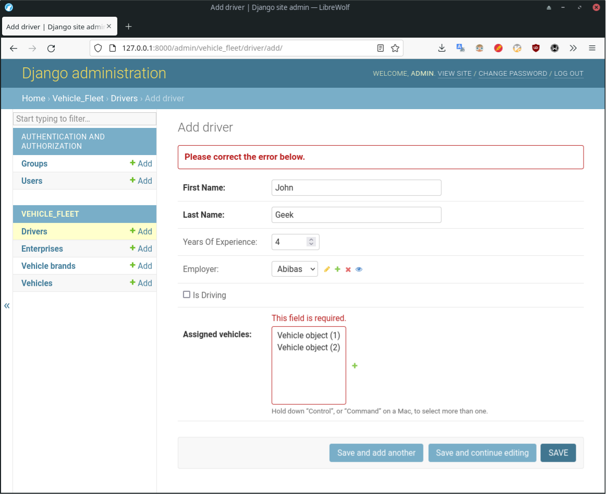

# Ход работы

Проект "Автопарк"


<details>
<summary><h2>Первичные настройки</h2></summary>

Создать приложение `vehicle_fleet`

Зарегистрировать приложение ([commit](https://github.com/DanilTsygolnik/django_study_proj_03/commit/bdbd71d4f8edaff1b9ea9e11e53839c2e3113055)).

</details>


<details>
<summary><h2>Этап 1</h2></summary>

#### Задача

Создать основную модель Vehicle (автомобиль) с несколькими полями на усмотрение (например, стоимость, год выпуска, пробег, и т. д.). Марку/бренд с техническими характеристиками пока не добавлять - это будет отдельная модель.

Зарегистрировать модель в админке, добавить 3-5 объектов в базу.

#### Ход работы

Создать модель Vehicle ([commit](https://github.com/DanilTsygolnik/django_study_proj_03/commit/023664c8a9e7cef50a662368ef357a637e280f44)).

Создать миграции для модели ([commit](https://github.com/DanilTsygolnik/django_study_proj_03/commit/86ea9811b90348078362afaf95b830f71a9a5c68)).

Зарегистрировать модель `Vehicle` в админке ([commit](https://github.com/DanilTsygolnik/django_study_proj_03/commit/0416ea85f61c2b68c5ece94c525edf57eb0ff9d6)).

<details>
<summary>Result</summary><br>
Вид админки до и после

</details>

</details>


<details>
<summary><h2>Этап 2</h2></summary>


#### Задача

Добавить отдельную модель брендов и привязать её к модели Vehicle, чтобы в админке, когда создаётся или редактируется новый автомобиль, поле бренда показывалось как выпадающий список. 

Добавить в модель Vehicle несколько других характеристик (например, тип авто, кол-во мест, цвет).

Выводить данные автомобиля в админке в более наглядном виде: id + бренд + пробег или цена например.

<details>
<summary><h4>Описание полей</h4></summary>

VehicleBrand (марка транспортного средства), поля:
- `title`: CharField, obligatory, max_length=20, 'Vehicle Brand'

---

VehicleModelInBrand (модель транспортного средства), поля:
- `vehicle_brand`: ForeignKey, VehicleBrand, on_delete.CASCADE (если удалить категорию, то удалить и все модели бренда)
- `title`: CharField, obligatory, max_length=20, 'Vehicle Model'

---

VehicleCategory (разновидность транспортного средства), поля:
- `title`: CharField, obligatory, max_length=20, 'Сategory'

Варианты: внедорожник/кроссовер, лифтбек, седан, хэтчбек, грузовик, автобус.

---

VehicleFuel (Тип топлива), поля:
- `title`: CharField, obligatory, max_length=20, 'Fuel Type'

Варианты: бензин, дизель.

---

VehicleEngineCapacity (объём двигателя), поля:
- `engine_capacity_liters`: DecimalField, obligatory, 99.99, 'Engine Capacity (liters)'

Примечание: максимальное число - [46,9 л](https://www.drom.ru/info/misc/10-c-f-k-fuel-economy-45684.html), так что   

---

VehicleTransmission (Коробка передач), поля:
- `title`: CharField, obligatory, max_length=20, 'Transmission Type'

Варианты: механика, автомат.

---

VehicleTypeOfDrive (Тип привода), поля:
- `title`: CharField, obligatory, max_length=20, 'Type Of Drive'

Варианты: задний, кардан, полный.

---

VehicleNumSeats (число мест), поля:
- `num_seats`: IntegerField, obligatory, 'Number Of Seats'

num_seats = models.IntegerField(verbose_name='Seats In Vehicle')

Варианты: 4, 5, 6, 7

---

VehicleNumDoors (число дверей), поля:
- `num_doors`: IntegerField, obligatory, 'Number Of Doors'

num_doors = models.IntegerField(verbose_name='Doors In Vehicle')

Варианты: 2, 3, 4, 5 

---

VehicleBodyColor (цвет кузова), поля:
- `title`: CharField, obligatory, max_length=20, 'Vehicle Body Color'

---

Vehicle (транспортное средство), поля:
- `brand`: ForeignKey, VehicleBrand, on_delete.CASCADE (если удалить категорию, то удалить и все транспортные средства)
- `model_in_brand`: ForeignKey, VehicleModelInBrand, on_delete.CASCADE (если удалить модельную линейку, то удалить и все транспортные средства)
- `category`: ForeignKey, VehicleCategory, on_delete.CASCADE
- `year_of_manufacture`: IntegerField, obligatory, 'Year Of Manufacture'
- `mileage_km`: IntegerField, obligatory, 'Mileage, km'
- `price_usd`: DecimalField, obligatory, 999999999.99, 'Price, USD'
- `fuel`: ForeignKey, VehicleFuel, models.SET_NULL (если удалить тип топлива, то транспортные средства не удалять - только заменить значение поля на Null), null=True, blank=True (для models.SET_NULL)
- `engine_capacity`: ForeignKey, VehicleEngineCapacity,  models.SET_NULL, null=True, blank=True (для models.SET_NULL)
- `transmission`: ForeignKey, VehicleTransmission, models.SET_NULL (если удалить тип привода, то транспортные средства не удалять - только заменить значение поля на Null), null=True, blank=True (для models.SET_NULL)
- `type_of_drive`: ForeignKey, VehicleTypeOfDrive, models.SET_NULL, null=True, blank=True (для models.SET_NULL)

- `num_seats`: ForeignKey, VehicleNumSeats,  models.SET_NULL, null=True, blank=True (для models.SET_NULL)
- `num_doors`: ForeignKey, VehicleNumDoors,  models.SET_NULL, null=True, blank=True (для models.SET_NULL)
- `body_color`: ForeignKey, VehicleBodyColor,  models.SET_NULL, null=True, blank=True (для models.SET_NULL)
- `description`: TextField, blank=True (optional field), 'Description'

---
</details>

#### Добавление моделей в проект

Добавить новые модели (см. коммиты a69c3dd...ae263ec).

Создать и применить миграции ([commit](https://github.com/DanilTsygolnik/django_study_proj_03/commit/b3a421872364e6a056262977dfe8d76cfd204f5d)).

Зарегистрировать модели в админке ([commit](https://github.com/DanilTsygolnik/django_study_proj_03/commit/09268db0938911e4afe21080299b739983133ff2)).

<details>
<summary>Result</summary>

</details>

<details>
<summary><h4>Исправить косяки в модели</h4></summary>

Исправить ошибку `__str__ returned non-string (type VehicleModelInBrand)` ([commit](https://github.com/DanilTsygolnik/django_study_proj_03/commit/a2300264d855a67cfaefb359cb82c221646b7a2f)).

<details>
<summary>Текст ошибки</summary>

</details>


Исправить ошибку `__str__ returned non-string (type Decimal)` ([commit](https://github.com/DanilTsygolnik/django_study_proj_03/commit/083cc907ebbbabd9076186a70c5fed38c6a3f1c4)).

<details>
<summary>Текст ошибки</summary>

</details>


Исправить ошибку `__str__ returned non-string (type int)` для моделей `VehicleNumSeats` ([commit](https://github.com/DanilTsygolnik/django_study_proj_03/commit/e14e0c16ca47dc09761bcb3b53899d20fdb73a01)) и `VehicleNumDoors` ([commit](https://github.com/DanilTsygolnik/django_study_proj_03/commit/0043f2300dfff5f69c34306b9f636845ed8e1102)).

<details>
<summary>Текст ошибки</summary>

</details>

</details>

<details>
<summary>Result</summary><br>
После добавления пары записей в БД

</details>


#### Настройки в админке

Отображение списка транспорта в админке (модель Vehicle) ([commit](https://github.com/DanilTsygolnik/django_study_proj_03/commit/5aaf2f7762f8636988097ffd14c7a6ef3c02eab6)).

<details>
<summary>Result</summary>

</details>

Добавить кликабельные заголовки (модель Vehicle) ([commit](https://github.com/DanilTsygolnik/django_study_proj_03/commit/723eb78c2de18ae6d1e35f40742adced720f5a5d)).

<details>
<summary>Result</summary>

</details>

---

#### Время на этап

Продумывание и описание полей модели: 3 часа 10 минут.

Кодирование: 2 часа 35 минут.

Редактирование отчёта: 30 минут.

#### Использованные материалы

Подсказка по созданию поля для валюты -[What is the best django model field to use to represent a US dollar amount?](https://stackoverflow.com/a/1139421) 
Аргументы `on_delete` - отличное [объяснение](https://stackoverflow.com/a/38389488).

</details>


<summary><h2>Этап 3</h2></summary>

<details>
<summary><h3>Задача</h3></summary>

Добавить ещё две базовые модели:
    1. Enterprise (предприятие)
2. Driver (водитель)

    Основные поля этим моделям придумать самостоятельно. Например, название + город, имя + зарплата.

    Организовать между ними такие связи:
    - Предприятию могут принадлежать несколько автомобилей (один ко многим).
    - Предприятию могут принадлежать несколько водителей (один ко многим).

    Дополнительные условия:
    - Автомобиль и водитель могут принадлежать только одному предприятию.
    - Каждому автомобилю может быть назначено несколько водителей (один к многим).
    - Один из назначенных водителей дополнительно считается "активным" (флажок) — это тот, кто работает на машине в данный момент.
    - Создаваемый водитель исходно ни к какой машине не привязан.
    - Автомобиль может переназначаться в админке другому предприятию, только если для него не назначен водитель (с галкой).

</details>


<details>
<summary><h4>Упростить модель Vehicle</h4></summary>

Убрал лишнее из Vehicle ([commit](https://github.com/DanilTsygolnik/django_study_proj_03/commit/ef178c81e3ac9f28f42f4a08d8acf93fe2a6a700)) и `admin.py` ([commit](https://github.com/DanilTsygolnik/django_study_proj_03/commit/ca824aa2833e62840db72eb25024d31cc55dfd8a)).

<details>
<summary>Result</summary>

</details>

Команда `python manage.py makemigrations` с имеющейся БД выдаёт следующее сообщение:
```
It is impossible to add a non-nullable field 'license_plate_num' to vehicle without specifying a default. This is because the database needs something to populate existing rows.
Please select a fix:
1) Provide a one-off default now (will be set on all existing rows with a null value for this column)
2) Quit and manually define a default value in models.py.
Select an option: _
```

Сношу БД, повторяю -- тот же результат. Сношу файлы миграций, создаю новые ([commit](https://github.com/DanilTsygolnik/django_study_proj_03/commit/88c9ca1783c3cca581546df37e0dfba20a8c968a)), снова создаю суперпользователя -- есть пустая БД. Добавляю пару моделей, чтобы проверить результат.

<details>
<summary>Result</summary>

</details>

</details>


<summary><h4>Работа по этапу 3</h4></summary>


+ создать модель предприятия
    + добавить модель
    + зарегистрировать модель в админке
    + связать Vehicle с Enterprise через FK (у одной машины м.б. только одно предприятие) -- поле owner
+ создать модель водителя
    + добавить модель 
    + зарегистрировать модель в админке
    + связать Driver  с Enterprise через FK (у одного водителя м.б. только одно предприятие) -- поле `employer`
+ добавить 2 предприятия в БД
+ добавить 3-х водителей (1 активный, 1 свободный, 1 без привязки к тачкам)


58 минут

----------------------------------------------------------------


+ связать Driver с Vehicle через FK (M:M) -- `assigned_vehicles`

<details>
<summary>Error</summary>

</details>

Создаю и применяю миграции
```bash
$ python manage.py makemigrations
# Migrations for 'vehicle_fleet':
#   vehicle_fleet/migrations/0003_driver_assigned_vehicles.py
#     - Add field assigned_vehicles to driver
$ python manage.py migrate
# Operations to perform:
#   Apply all migrations: admin, auth, contenttypes, sessions, vehicle_fleet
# Running migrations:
#   Applying vehicle_fleet.0003_driver_assigned_vehicles... OK
```
В результате в форме редактирования модели Driver появляется список, в котором доступен множественный выбор элементов:

<details>
<summary>Result</summary>

</details>

Проблема: поле для М:М валидируется, как обязательное ([fix commit](https://github.com/DanilTsygolnik/django_study_proj_03/commit/5c3f70e8bf2b5ba7654ba81e57000de1c32a8503)).
<details>
<summary>Issue</summary>

</details>

[Подсказка](https://stackoverflow.com/a/2529875):
> If you want to be able to specify ManyToMany relation without making it required just use `blank=True`

`null=True` добавлять не нужно, т.к. при М:М этот параметр не имеет влияния:
```
WARNINGS:
vehicle_fleet.Driver.assigned_vehicles: (fields.W340) null has no effect on ManyToManyField.
```

В форме Vehicle не видно назначенных водителей, но но через shell всё работает:

Назначена машина
driver1_assigned_vehicles.png
```python
>>> from vehicle_fleet.models import Driver, Vehicle
>>> Vehicle.objects.get(pk=1).driver_set.all()
### <QuerySet [<Driver: Driver object (1)>]>
>>> Driver.objects.get(pk=1).assigned_vehicles.all()
### <QuerySet [<Vehicle: Vehicle object (1)>]>
```
Снимаем назначение в админке из под Driver
driver1_no_assigned_vehicles.png
```python
>>> Vehicle.objects.get(pk=1).driver_set.all()
### <QuerySet []>
>>> Driver.objects.get(pk=1).assigned_vehicles.all()
### <QuerySet []>
```

Время 1:38

----------------------------------------------------------------

Улучшил отображение Vehicle ([commit](https://github.com/DanilTsygolnik/django_study_proj_03/commit/e025115a0af32c32a0e2917fef9d224736265289)).  [^show-a-field-from-a-foreign-model]

<details>
<summary>Result</summary>

</details>


Проблема: водителю назначено несколько тачек. Если задать `is_driving=True`, то непонятно, на какой из машин он едет - косяк.

Переделываю в точности по ТЗ, связываю Driver:Vehicle как M:1 ([commit](https://github.com/DanilTsygolnik/django_study_proj_03/commit/95e9ee1d02d4a624eec69701fd26cc8c52b5fad8)).

Создаю ([commit](https://github.com/DanilTsygolnik/django_study_proj_03/commit/ebd87e115d066e4316dcd3e123dcc1af4707fe37)) и применяю миграции, ОК:

<details>
<summary>Result</summary>

</details>


[Following relationships “backward”](https://docs.djangoproject.com/en/3.0/topics/db/queries/#following-relationships-backward): модель Driver хранит FK на Vehicle. Возьмём для примера `bmw` (объект Vehicle), тогда список водителей `bmw` получим как объект `bmw.driver_set.all()`, где `driver_set` - дефолтное обращение к модели `Driver` (lowercase). Дефолтное значение можно переписать с помощью атрибута `related_name`, например:
```python
class Article:
    blog = ForeignKey(Blog, on_delete=models.CASCADE, related_name='articles')
    #...
```

Таким образом, можно определить, занята ли сейчас конкретная машина:
```python
>>> from vehicle_fleet.models import Driver, Vehicle
# Проверяем BMW
>>> bmw = Vehicle.objects.get(pk=1)
>>> bmw_drivers = bmw.driver_set.all()
# Фильтруем по полю is_driving. Машина занята.
>>> bmw_drivers.filter(is_driving=True)
### <QuerySet [<Driver: Driver object (1)>]>
>>> john = Driver.objects.get(pk=1)
# Снимаем водителя с BMW
>>> john.is_driving = False
>>> john.save()
# Активных водителей нет
>>> bmw_drivers.filter(is_driving=True)
### <QuerySet []>
```

Заготовка под валидатор:
```python
vehicle_obj
vehicle_is_busy = (len(vehicle_obj.driver_set.filter(is_driving=True)) != 0)
if vehicle_is_busy:
    raise ValidationError('...')

```

Машину нельзя переписать на другое предприятие, если `vehicle_is_busy`.

Другого водителя данной машины нельзя назначить на неё, пока работает другой (ОДИН из водителей считается активным).


время 2:44

----------------------------------------------------------------


> Fields are single data points, forms are a collection of fields.

Предполагаю, что вариант с `clean_owner_id` не сработал, т.к. это перегрузка валидации отдельного поля, а мне нужен `clean()`

При работе с `clean_owner_id` через обращение к `self` происходит доступ только к значению данного поля (?). Мне же нужен доступ к значениям нескольких полей: `id`, `owner_id`.


Время 2:53 до коммита ([commit](https://github.com/DanilTsygolnik/django_study_proj_03/commit/5237a275b1e8162e1f762b8dee456a3f94197f90))

----------------------------------------------------------------

Форма подключается - проверил с помощью `fields` и `excludes` в `VehicleAdminForm.Meta`

Проблема в валидаторе...

```python
# Никаких изменений
def clean_owner_id(self):
    raise ValidationError()
```

Прочитал [пост](https://stackoverflow.com/a/1872108) и [доки](https://docs.djangoproject.com/en/4.1/ref/forms/validation/#cleaning-and-validating-fields-that-depend-on-each-other), попробовал добавить перед `clean_owner_id` следующее:
```python
def clean(self):
    raise ValidationError('Test error')
```
на странице появилось соответствующее предупреждение.

Переписал валидатор ([commit](https://github.com/DanilTsygolnik/django_study_proj_03/commit/1af9df5e10888bb73cb94437eebb030f6177580d)), упёрся в проблему: в форме присутствуют всё поля, кроме id редактируемой машины. Из-за этого `vehicle_id` отсаётся None, что приводит к ошибке - невозможно обратиться из кода к модели Vehicle для дальнейших операций.

<details>
<summary>Result</summary>

</details>

Использованные материалы:
* [Form and field validation | Django documentation](https://docs.djangoproject.com/en/dev/ref/forms/validation/#cleaning-a-specific-field-attribute)
* [Understand clean() and clean_<fieldname>() in Django](https://sayari3.com/articles/12-understand-clean-and-clean_fieldname-in-django/)

Время 2 часа

----------------------------------------------------------------

[Research](forms_validation_research.md)

Доки:
* [Models | Django documentation | Django](https://docs.djangoproject.com/en/4.1/topics/db/models/ "Models | Django documentation | Django")
* [Forms | Django documentation | Django](https://docs.djangoproject.com/en/4.1/ref/forms/ "Forms | Django documentation | Django")
* [Form and field validation | Django documentation | Django](https://docs.djangoproject.com/en/4.1/ref/forms/validation/#using-validation-in-practice "Form and field validation | Django documentation | Django")
* [Creating forms from models | Django documentation | Django](https://docs.djangoproject.com/en/4.1/topics/forms/modelforms/ "Creating forms from models | Django documentation | Django")
* [Validators | Django documentation | Django](https://docs.djangoproject.com/en/4.1/ref/validators/ "Validators | Django documentation | Django")


Время 2:17

---

- добавить валидацию поля `owner` у Vehicle
    - написать кастомную форму для модели Vehicle
        - добавить `owner` в вывод админки для Vehicle
    - добавить валидацию соотв. поля


[^show-a-field-from-a-foreign-model]: https://www.dothedev.com/blog/2019/10/12/django-admin-show-custom-field-list_display/
